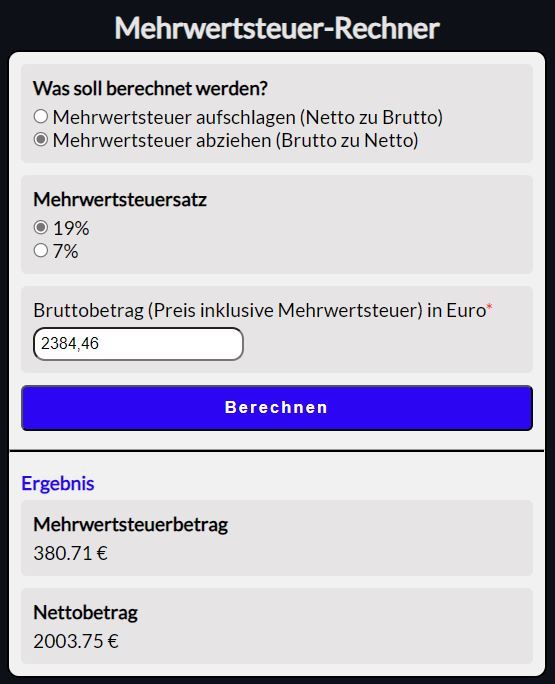
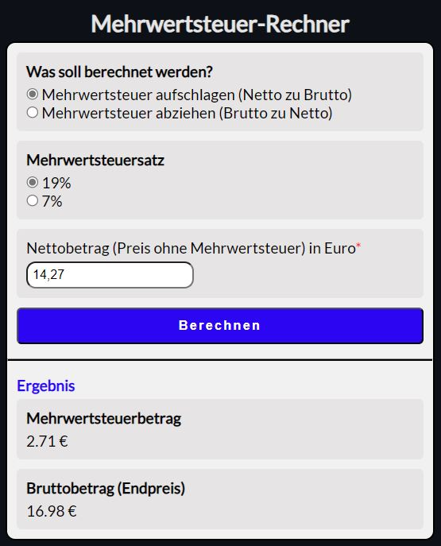

# Mehrwertsteuer-Rechner – JavaScript-Projekt

## Beschreibung

Dieses JavaScript-Projekt wurde im Rahmen eines Coding-Bootcamps bei supercode.de erstellt. Es handelt sich um einen Mehrwertsteuer-Rechner, der es ermöglicht, die Mehrwertsteuer für verschiedene Mehrwertsteuersätze (19% und 7%) zu berechnen. Mithilfe eines benutzerfreundlichen Formulars können Nutzer entweder einen Nettobetrag (Preis ohne Mehrwertsteuer) oder einen Bruttobetrag (Preis inklusive Mehrwertsteuer) in Euro eingeben.

Die Anwendung bietet die Möglichkeit, die folgenden Berechnungen durchzuführen:

- Mehrwertsteuer aufschlagen (Netto zu Brutto)
- Mehrwertsteuer abziehen (Brutto zu Netto)

Durch die Auswahl einer der beiden Radio-Buttons ändert sich der Labeltext des Number-Inputfeldes entsprechend.

## Funktionsweise

1. Wähle aus, ob du die Mehrwertsteuer aufschlagen oder abziehen möchtest.
2. Gib den Betrag in das Number-Inputfeld ein, entweder als Nettobetrag oder Bruttobetrag, abhängig von deiner vorherigen Auswahl.
3. Wähle den gewünschten Mehrwertsteuersatz (19% oder 7%) mithilfe der Radio-Buttons.
4. Klicke auf den "Berechnen"-Button, um die Berechnung durchzuführen.
5. Die Anwendung zeigt den Mehrwertsteuerbetrag in Euro sowie den Bruttobetrag (Endpreis) oder den Nettobetrag an, je nachdem, welchen Radio-Button du oben ausgewählt hast.

## Screenshots

## GitHub Repository

Du findest das gesamte Projekt auf GitHub: [GitHub Repository](https://w1tch3r-code.github.io/js_mehwertsteuer_rechner/)

## Anmerkungen

- Dieses Projekt wurde im Rahmen eines Coding-Bootcamps bei supercode.de erstellt.
- Die Anwendung ermöglicht eine einfache und schnelle Berechnung der Mehrwertsteuer für verschiedene Mehrwertsteuersätze.
- Die README.md-Datei dient auch als Bewerbungsunterlage und präsentiert meine Fähigkeiten in der Webentwicklung.